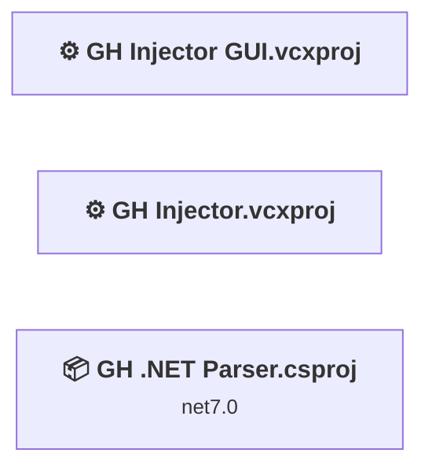
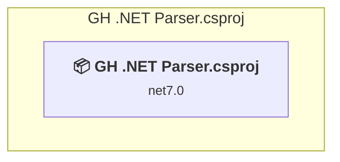
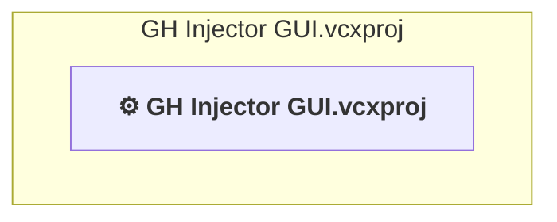
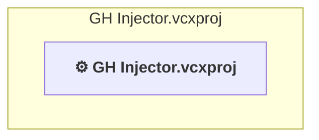

# Projects and dependencies analysis

This document provides a comprehensive overview of the projects and their dependencies in the context of upgrading to .NETCoreApp,Version=v10.0.

## Table of Contents

- [Executive Summary](#executive-Summary)
  - [Highlevel Metrics](#highlevel-metrics)
  - [Projects Compatibility](#projects-compatibility)
  - [Package Compatibility](#package-compatibility)
  - [API Compatibility](#api-compatibility)
- [Aggregate NuGet packages details](#aggregate-nuget-packages-details)
- [Top API Migration Challenges](#top-api-migration-challenges)
  - [Technologies and Features](#technologies-and-features)
  - [Most Frequent API Issues](#most-frequent-api-issues)
- [Projects Relationship Graph](#projects-relationship-graph)
- [Project Details](#project-details)

  - [GH .NET Parser\GH .NET Parser.csproj](#gh-net-parsergh-net-parsercsproj)
  - [GH Injector GUI\GH Injector GUI.vcxproj](#gh-injector-guigh-injector-guivcxproj)
  - [GH Injector\GH Injector.vcxproj](#gh-injectorgh-injectorvcxproj)

## Executive Summary

### Highlevel Metrics

| Metric | Count | Status |
| :--- | :---: | :--- |
| Total Projects | 3 | 1 require upgrade |
| Total NuGet Packages | 1 | All packages need upgrade |
| Total Code Files | 1 |  |
| Total Code Files with Incidents | 2 |  |
| Total Lines of Code | 203 |  |
| Total Number of Issues | 7 |  |
| Estimated LOC to modify | 5+ | at least 2.5% of codebase |

### Projects Compatibility

| Project | Target Framework | Difficulty | Package Issues | API Issues | Est. LOC Impact | Description |
| :--- | :---: | :---: | :---: | :---: | :---: | :--- |
| [GH .NET Parser\GH .NET Parser.csproj](#gh-net-parsergh-net-parsercsproj) | net7.0 | 🟢 Low | 1 | 5 | 5+ | DotNetCoreApp, Sdk Style = True |
| [GH Injector GUI\GH Injector GUI.vcxproj](#gh-injector-guigh-injector-guivcxproj) |  | ✅ None | 0 | 0 |  | ClassicDotNetApp, Sdk Style = False |
| [GH Injector\GH Injector.vcxproj](#gh-injectorgh-injectorvcxproj) |  | ✅ None | 0 | 0 |  | ClassicDotNetApp, Sdk Style = False |

### Package Compatibility

| Status | Count | Percentage |
| :--- | :---: | :---: |
| ✅ Compatible | 0 | 0.0% |
| ⚠️ Incompatible | 0 | 0.0% |
| 🔄 Upgrade Recommended | 1 | 100.0% |
| ***Total NuGet Packages*** | ***1*** | ***100%*** |

### API Compatibility

| Category | Count | Impact |
| :--- | :---: | :--- |
| 🔴 Binary Incompatible | 0 | High - Require code changes |
| 🟡 Source Incompatible | 5 | Medium - Needs re-compilation and potential conflicting API error fixing |
| 🔵 Behavioral change | 0 | Low - Behavioral changes that may require testing at runtime |
| ✅ Compatible | 157 |  |
| ***Total APIs Analyzed*** | ***162*** |  |

## Aggregate NuGet packages details

| Package | Current Version | Suggested Version | Projects | Description |
| :--- | :---: | :---: | :--- | :--- |
| System.Reflection.MetadataLoadContext | 7.0.0 | 10.0.8 | [GH .NET Parser.csproj](#gh-net-parsergh-net-parsercsproj) | NuGet package upgrade is recommended |

## Top API Migration Challenges

### Technologies and Features

| Technology | Issues | Percentage | Migration Path |
| :--- | :---: | :---: | :--- |

### Most Frequent API Issues

| API | Count | Percentage | Category |
| :--- | :---: | :---: | :--- |
| M:System.Reflection.MetadataLoadContext.LoadFromAssemblyPath(System.String) | 1 | 20.0% | Source Incompatible |
| T:System.Reflection.MetadataLoadContext | 1 | 20.0% | Source Incompatible |
| M:System.Reflection.MetadataLoadContext.#ctor(System.Reflection.MetadataAssemblyResolver,System.String) | 1 | 20.0% | Source Incompatible |
| T:System.Reflection.PathAssemblyResolver | 1 | 20.0% | Source Incompatible |
| M:System.Reflection.PathAssemblyResolver.#ctor(System.Collections.Generic.IEnumerable{System.String}) | 1 | 20.0% | Source Incompatible |

## Projects Relationship Graph

Legend:
📦 SDK-style project
⚙️ Classic project

## Project Details

### GH .NET Parser\GH .NET Parser.csproj

#### Project Info

- **Current Target Framework:** net7.0
- **Proposed Target Framework:** net10.0
- **SDK-style**: True
- **Project Kind:** DotNetCoreApp
- **Dependencies**: 0
- **Dependants**: 0
- **Number of Files**: 1
- **Number of Files with Incidents**: 2
- **Lines of Code**: 203
- **Estimated LOC to modify**: 5+ (at least 2.5% of the project)

#### Dependency Graph

Legend:
📦 SDK-style project
⚙️ Classic project

### API Compatibility

| Category | Count | Impact |
| :--- | :---: | :--- |
| 🔴 Binary Incompatible | 0 | High - Require code changes |
| 🟡 Source Incompatible | 5 | Medium - Needs re-compilation and potential conflicting API error fixing |
| 🔵 Behavioral change | 0 | Low - Behavioral changes that may require testing at runtime |
| ✅ Compatible | 157 |  |
| ***Total APIs Analyzed*** | ***162*** |  |

### GH Injector GUI\GH Injector GUI.vcxproj

#### Project Info

- **Current Target Framework:** ✅
- **SDK-style**: False
- **Project Kind:** ClassicDotNetApp
- **Dependencies**: 0
- **Dependants**: 0
- **Number of Files**: 0
- **Lines of Code**: 0
- **Estimated LOC to modify**: 0+ (at least 0.0% of the project)

#### Dependency Graph

Legend:
📦 SDK-style project
⚙️ Classic project

### API Compatibility

| Category | Count | Impact |
| :--- | :---: | :--- |
| 🔴 Binary Incompatible | 0 | High - Require code changes |
| 🟡 Source Incompatible | 0 | Medium - Needs re-compilation and potential conflicting API error fixing |
| 🔵 Behavioral change | 0 | Low - Behavioral changes that may require testing at runtime |
| ✅ Compatible | 0 |  |
| ***Total APIs Analyzed*** | ***0*** |  |

### GH Injector\GH Injector.vcxproj

#### Project Info

- **Current Target Framework:** ✅
- **SDK-style**: False
- **Project Kind:** ClassicDotNetApp
- **Dependencies**: 0
- **Dependants**: 0
- **Number of Files**: 0
- **Lines of Code**: 0
- **Estimated LOC to modify**: 0+ (at least 0.0% of the project)

#### Dependency Graph

Legend:
📦 SDK-style project
⚙️ Classic project

### API Compatibility

| Category | Count | Impact |
| :--- | :---: | :--- |
| 🔴 Binary Incompatible | 0 | High - Require code changes |
| 🟡 Source Incompatible | 0 | Medium - Needs re-compilation and potential conflicting API error fixing |
| 🔵 Behavioral change | 0 | Low - Behavioral changes that may require testing at runtime |
| ✅ Compatible | 0 |  |
| ***Total APIs Analyzed*** | ***0*** |  |

